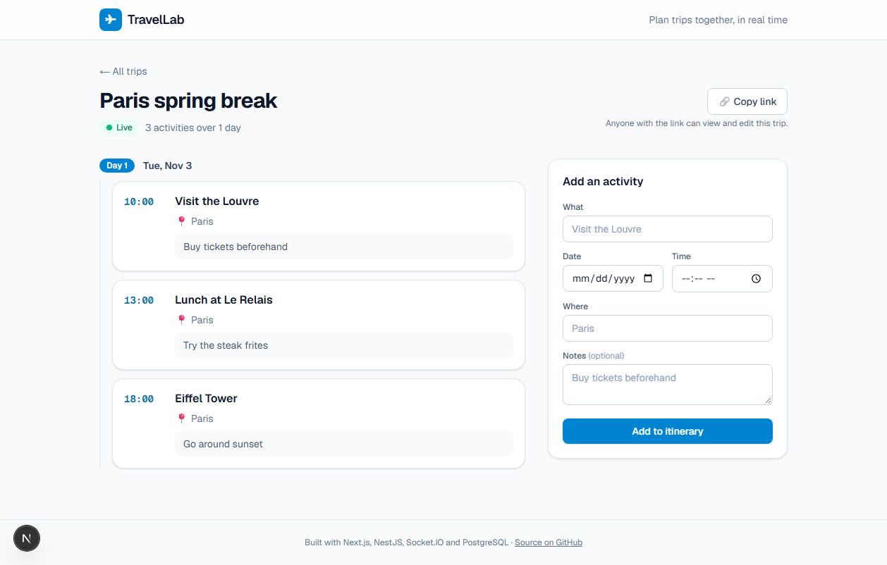
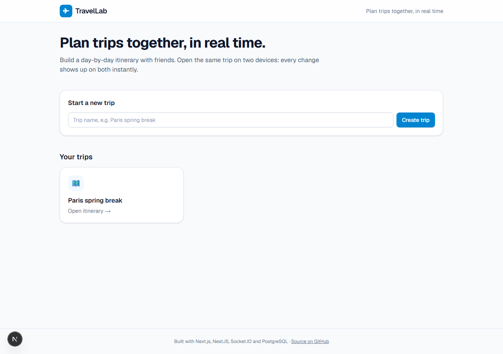

# TravelLab Web App

The web app for **TravelLab**, a real-time collaborative trip planner. Friends build one shared, day-by-day itinerary, and every change shows up for everyone viewing the trip instantly.

**Live demo: [travellab-app.vercel.app](https://travellab-app.vercel.app)**

> The backend runs on a free plan that sleeps when idle, so the first load can take up to a minute while it wakes up.



**Try the live sync:** open the same trip in two windows (or your laptop and your phone), add or edit an activity in one, and watch the other update by itself.

The backend (NestJS, PostgreSQL, Socket.IO), the architecture and the design decisions are in **[TravelLab-backend](https://github.com/avasadasivan/TravelLab-backend)**.

## Features

- Create trips and build a day-by-day itinerary (time, place, notes)
- Add, edit and delete activities
- Live sync over Socket.IO, with a "Live" indicator when connected
- Rejoins and refetches after a dropped connection, so no update is missed
- "Copy link" to share a trip
- Loading and error screens designed around the free server's cold start
- Responsive layout, from phone to desktop



## How it works

- Pages are **Next.js server components**: they fetch the trip from the REST API on the server, at request time (never at build time).
- Forms are client components that send REST requests (`POST`, `PATCH`, `DELETE`) to the backend.
- `LiveSync` (a client component) connects to the backend with Socket.IO and joins the trip's room. When it hears a change such as `activity.created`, it calls `router.refresh()`, which re-runs the server components with fresh data, so the page updates in place without a reload.
- All backend calls live in [`app/lib/api.ts`](app/lib/api.ts).

## Tech stack

Next.js 16 (App Router), React 19, TypeScript, Tailwind CSS 4, Socket.IO client. Deployed on Vercel.

## Run locally

Start the [backend](https://github.com/avasadasivan/TravelLab-backend) first (it serves `http://localhost:3001`), then:

```bash
npm ci
npm run dev    # http://localhost:3000
```

To point at a different backend, set `NEXT_PUBLIC_API_BASE` (see `.env.example`). It's baked in at build time, so restart or rebuild after changing it.
